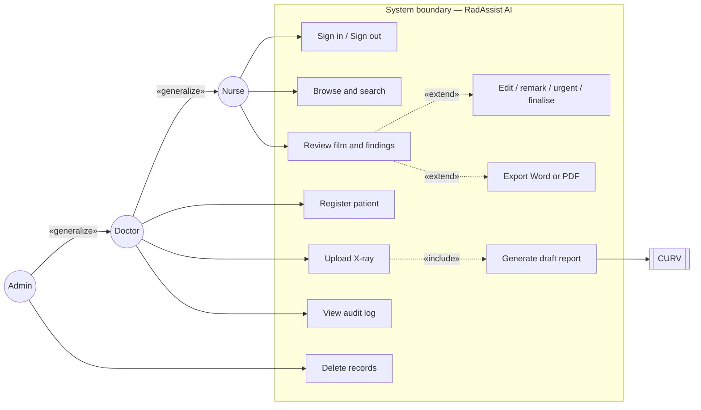
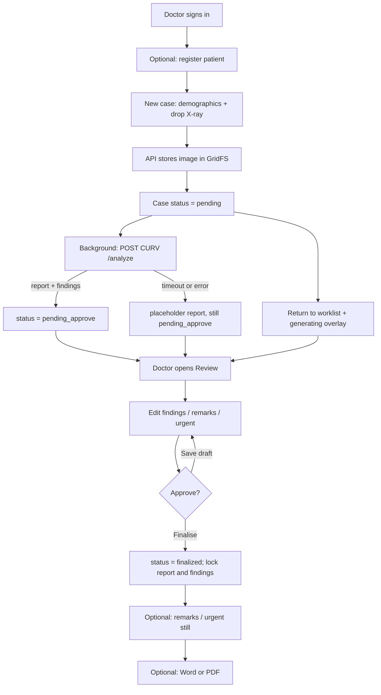
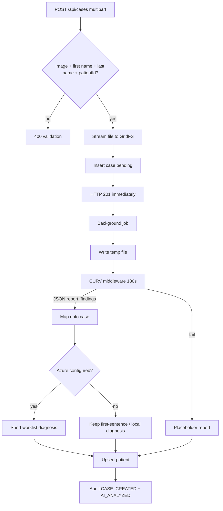
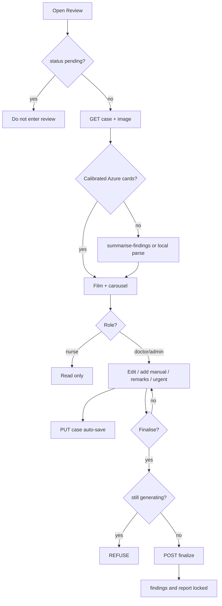
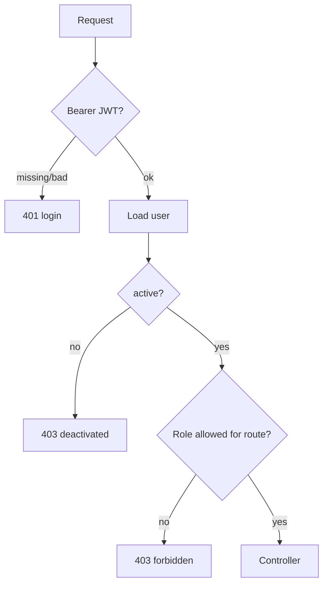
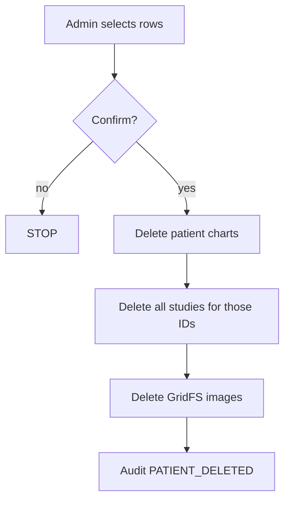
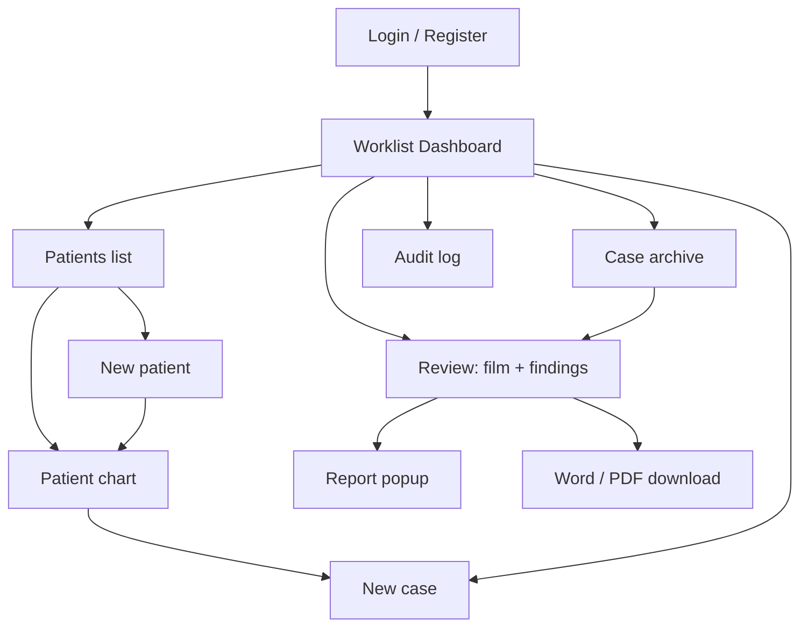

# An AI-assisted Online System for X-Ray Report Generation

**Student:** PANG Ho Yiu (23226609)  
**Working name:** RadAssist AI  
**Document:** Project Plan and Initial System Analysis  
**Source documents:** Project Statement; supervisor briefing slide  
**Type:** Final Year Project (demonstration system, not a clinical product)

> How to use this file: paste into Word, insert the briefing slide as **Figure 1** next to A.1, insert app screenshots in Section B.3, and tick the Department hardware/software list against Section A.2.

---

# a. Project Plan

## A.1 Brief Introduction to the Proposed System

This plan follows the approved **Project Statement** (PANG Ho Yiu, 23226609) and the supervisor briefing: *An AI-assisted Online System for X-Ray Report Generation*. The FYP does **not** retrain CURV or AHIVE. It is the **practicum / deployment** piece: wrap those pretrained engines in a complete web information system that a clinical user can use, edit, and export [3].

### A.1.1 Project background

Medical imaging analysis — especially chest X-ray interpretation — sits in many clinical workflows. The next generation of deep learning and vision-language models, both **generative** (**CURV**: Coherent Uncertainty-Aware Reasoning) and **discriminative** (**AHIVE**: Anatomy-aware Hierarchical Vision Encoding), has pushed the state of the art in writing text-based radiology reports from images [1][2].

Even a well-trained diagnostic model still **languishes in scripts and local research environments**. Doctors also spend a long time writing the same reports by hand. Outside the lab, a machine-learning model is only as useful as it is **realisable on a fast, safe, accessible platform** that healthcare workers can actually open. Bridging that **deployment gap** into a practicum system is the distinctive part of this FYP [3].

The project therefore builds an **end-to-end web information system**: pretrained AI engines behind a solid web interface, turning raw model output into something a clinical user can engage with and **export as a document**.

The briefing slide shows the intended interaction: film on the left, numbered region boxes, grounded findings on the right. This prototype’s review screen is that layout in a browser.

### A.1.2 Problem / improvement areas

The Project Statement names three operational bottlenecks [3]. The briefing slide states the same core problem: preparing an X-ray report is **professional and yet time-consuming**.

| # | Bottleneck (statement) | What “better” looks like |
| --- | --- | --- |
| 1 | **Time-consuming report workflow.** Diagnostic imaging reports are professional work product and occupy valuable hours. | AI produces a first draft; the doctor reviews and finalises instead of typing from a blank page. |
| 2 | **Accessibility of AI utilities.** Research models usually have no standard web UI; they stay with the “digital magician,” out of reach of the practitioner. | Browser login, upload, worklist — no Python notebook, no command line. |
| 3 | **Batch / static I/O.** Image-in, text-out systems are not interactive. Radiologists need to upload on the fly, **see the region the model used**, and **edit the text**. | Side-by-side film + overlays + editable finding cards (diagnostic chips), then Word/PDF export. |

This FYP is an **information-systems** project (workflow, UI, API, documents), not a new accuracy benchmark for CURV.

### A.1.3 Objectives

1. Develop an **online prototype** that uses a pretrained AI model (**CURV**) to **assist** radiologists by generating X-ray reports (briefing + statement).
2. Provide an **interactive, user-friendly interface** that speeds up report preparation: upload, grounded boxes, editable findings, finalise, export (briefing).
3. Wrap the model in a **complete web information system** (sessions, async inference, persistence, document generation) so it is usable outside a research script [3].
4. Keep the **clinician in the loop**: AI output is a draft until a doctor or admin finalises it. Nurses may read but not change clinical content.
5. Run **locally in Semester 1** (supervisor). Optional 24/7 server in **Semester 2**.

### A.1.4 Proposed system

Working name: **RadAssist AI**. Clinician-in-the-loop web application:

1. Authorised staff (doctor, nurse, administrator) sign in.
2. Patient chart (name, age, sex, history) before or at imaging.
3. Upload chest X-ray. Sem 1 formats: **PNG / JPG / JPEG / WebP**. The statement lists DICOM as an example; a DICOM store/viewer is a **Semester 2 stretch**, not required for the first prototype.
4. **Asynchronous** backend job calls **local CURV** (`mlx_vlm`); response is report text plus bounding boxes where a finding can be localised [3].
5. Frontend renders the film with **interactive overlays** and **editable finding cards**; doctor remarks, urgency, explicit **finalisation**.
6. Nurses **read** only.
7. Audit log; **PDF / DOCX** export of the verified report [3].

Decision-support prototype only — not a PACS, not a medical device, not a substitute for a radiologist. If CURV is down, the case is still stored so the clinician can write the report by hand.

**Out of scope unless Sem 2 time allows:** retraining CURV/AHIVE; full DICOM/PACS; hospital SSO; extra identifiers (e.g. HKID); CE/FDA claims; unattended auto-sign-off.

### A.1.5 Development methodology (from the Project Statement)

Four phases [3]. Success is measured as an **information system** (API behaviour, pipeline latency, browser UI), not only model accuracy.

| Phase | Statement plan | How this prototype implements it |
| --- | --- | --- |
| **1. Requirements & workflow** | Upload → async process → report + bboxes → render with overlays. | New case upload; Express returns 201 while CURV runs; worklist “Generating” overlay; Review shows film + boxes. |
| **2. Frontend & interaction** | SPA; **bilateral binding** (text ↔ region); **confidence threshold** slider; **interactive sentence / chip** editing. | Vanilla JS SPA (Vite + Tailwind). Statement mentioned React/Vue as examples; a lightweight SPA meets the same interaction goals. **Now:** finding cards (chips) with inline edit; active card’s bbox on the film. **Later (Sem 2 polish):** hover binding both ways; a global confidence slider to show/hide boxes without reload. |
| **3. Backend API gateway** | Node.js routes, sessions, queue; **document engine** (PDF/DOCX) after the user verifies edits. | Express + JWT; background AI job; `docx` / PDF download after save. Cosmos DB + GridFS persist patients, cases, images. |
| **4. Verification & (later) deploy** | Black-box API tests; upload-to-UI latency; browser compatibility. | Frontend unit tests + case e2e script. Sem 1: local demo. Sem 2: optional 24/7 host, more API tests, multi-browser check. |

---

## A.2 Resource Implications

*[Please replace the “Dept list” column after you open the Department’s official hardware and software list. Items not on that list may be unavailable and must be provided by the student or by a free/student cloud tier.]*

### A.2.1 Hardware

| Item | Purpose | Likely on Dept list? | Plan if unavailable |
| --- | --- | --- | --- |
| Student Apple Silicon Mac (already owned) | Run CURV / `mlx_vlm` locally; host the demo | Unlikely (Dept labs are usually Windows PCs) | Use personal Mac for AI inference. This is the critical resource. |
| Dept Windows PC / laptop | Coding, Word, browser testing | Usually yes | Use for documentation and secondary UI testing. Do **not** rely on it for CURV. |
| 16 GB+ RAM, SSD | Model weights + Node + browser | Check list | Personal Mac already meets this. |
| GPU / CUDA workstation | Alternative inference host | Sometimes a shared lab GPU | Not required while `mlx_vlm` runs on Apple Silicon. Sem 2 deploy would need a dedicated box. |
| Display ≥ 1920×1080 | Review screen (film + finding cards) | Yes | Any lab monitor is enough for the viva. |
| Network (campus Wi-Fi / Ethernet) | Cosmos DB and optional Azure OpenAI | Yes | Local CURV still works if cloud is down; cases save with a placeholder report. |

**Implication:** the vision model is tied to the student’s Mac. A Department PC alone cannot currently replace it. That matches the supervisor’s “run on your local machine first” instruction.

### A.2.2 Software

| Item | Role | Licence | Likely on Dept list? |
| --- | --- | --- | --- |
| Node.js 20+, npm | Backend (Express) and frontend (Vite) | Open source | Often yes, or installable by student |
| Python 3.12, `mlx_vlm` | Local CURV server | Open source | **Unlikely** — student-installed on Mac |
| CURV model weights (`~/CURV-mlx`) | Chest X-ray report generation | Research weights already downloaded | Not a Dept item |
| Visual Studio Code / Cursor | Development | Free | Usually yes |
| Git | Version control | Open source | Yes |
| Chrome / Edge / Safari | Client | Free | Yes |
| Microsoft Word / PowerPoint | Report and viva | Campus licence | Yes |
| Express 4, Mongoose 8, JWT, Helmet | REST API, auth, security headers | Open source (npm) | N/A (student stack) |
| Vite 8, Tailwind CSS 3 | UI | Open source | N/A |
| FastAPI / Uvicorn | Thin middleware in front of `mlx_vlm` | Open source | N/A |
| Azure Cosmos DB (Mongo API) | Patients, cases, users, audit, GridFS images | Azure student / pay-as-you-go | Check whether Dept offers Azure credits |
| Azure OpenAI (optional) | Short worklist diagnosis + finding cards | Azure | Optional; system runs without it |
| PlantUML / draw.io / Mermaid | UML for this document | Free | Yes |

**Implication:** all application code is free/open source. The only paid or quota-limited services are Azure Cosmos DB and, if enabled, Azure OpenAI. Neither is required on the Department software CD/image; they are cloud services.

### A.2.3 Data and ethics (resource, not hardware)

Demo patients and films only. No real hospital export. No HKID, address, or other extra identifiers. Seed accounts (`admin123`, etc.) are for local demo only.

---

## A.3 Development and Operating Costs

Figures are **order-of-magnitude estimates in HKD** for a student demonstration, not a hospital procurement. Labour is the student’s own FYP time and is shown only to make the cost–benefit discussion honest.

### A.3.1 Development costs (one-off, Sem 1–2)

| Cost item | Estimate | Notes |
| --- | --- | --- |
| Student development time (~400–500 hours FYP) | HKD 0 cash (opportunity cost only) | Design, code, test, report, viva |
| Personal Mac already owned | HKD 0 incremental | Would be ~HKD 8,000–15,000 if purchased only for this project |
| CURV weights + `mlx_vlm` | HKD 0 | Already downloaded; research use |
| Open-source stack | HKD 0 | Node, Python, Vite, Express |
| Azure Cosmos DB during development | ~HKD 0–150 / semester | Serverless / student subscription; low document volume |
| Azure OpenAI during development (optional) | ~HKD 0–200 / semester | Only if finding-card vision is turned on |
| Domain / 24/7 VM (Sem 2, optional) | HKD 0 in Sem 1; ~HKD 200–600 / semester later | Supervisor: deploy in Sem 2 |
| **Cash outlay Sem 1** | **≈ HKD 0–350** | Dominated by Azure if used |

### A.3.2 Operating costs (if the demo is kept running)

| Cost item | Local laptop demo | Sem 2 24/7 server (optional) |
| --- | --- | --- |
| Electricity (Mac + screen) | Negligible / personal | VM billed by cloud |
| Database | Cosmos: a few dollars/month at demo scale | Same |
| AI inference | Local Mac: HKD 0 API fees | GPU/Apple box must stay on; electricity + maybe cloud GPU |
| Azure OpenAI | Off = HKD 0; On = usage-based | Same |
| Maintenance | Student restarts three processes | Process manager + backups |
| **Recommended operating mode for FYP** | **Laptop demo for viva** | Only if supervisor requests a public URL |

There is **no licence fee** for the application itself. The expensive part of a real hospital system (PACS, HL7, 24/7 SLA, clinical validation) is deliberately out of scope, so operating cost stays in the student-cloud range.

---

## A.4 Tangible and Intangible Benefits

### A.4.1 Tangible (observable, even in a demo)

| Benefit | Who | How the prototype shows it |
| --- | --- | --- |
| Faster first draft | Doctor | Upload → background CURV job → worklist row moves from *Generating* to *Pending approve* |
| Structured findings, not only a wall of text | Doctor | Finding carousel: label, location, size, pattern, confidence, bbox on the film |
| Human sign-off is mandatory | Patient safety (demo) | Status cannot skip to *Finalized* while the draft is still generating; nurses cannot finalise |
| Role separation | Ward / clinic | Nurse: read-only; Doctor/Admin: edit; Admin: bulk delete |
| Searchable worklist | All roles | Filter by status / urgent; live search; urgent rows sort first |
| Export | Doctor | Word and PDF of the stored report (plus the uploaded film) |
| Traceability | Admin / supervisor | Audit log of login, create, AI analyse, update, finalise, delete |
| Patient chart independent of a film | Clerk / doctor | Patient can exist with zero studies; New Case can look up an existing ID |
| Degraded operation | Ops | If CURV is down, the case is still saved; clinician can type the report |

### A.4.2 Intangible

- Reinforces **clinician-in-the-loop** as a design principle (AI drafts; human decides).
- Gives nurses a way to **see** urgency and reports without being able to alter them.
- Student learning: full-stack web system, JWT roles, GridFS, local VLM, optional cloud NLP.
- Reusable demo for the viva: one laptop, three processes, seeded users.
- Clear story for Semester 2 (hardening, CORS, cookies, possible deploy) without blocking Semester 1.

---

## A.5 Cost–Benefits Analysis

This is not a commercial product, so a classic NPV is not meaningful. The comparison is **student cash + time versus FYP learning outcomes and demo quality**.

| Option | Cash (Sem 1) | Time | Benefit | Risk |
| --- | --- | --- | --- | --- |
| **A. Do nothing / report-only FYP** | HKD 0 | Low | Weak viva | Fails “working system” expectation |
| **B. Script: image in, text out (old demo)** | HKD 0 | Low–medium | Proves CURV works | No workflow, no roles, no persistence |
| **C. Proposed local web system (recommended)** | HKD 0–350 | High | Full use-case demo, audit, HITL | Tied to student’s Mac for AI |
| **D. Full 24/7 hospital-like deploy now** | Higher VM/GPU | High + ops | Public URL | Supervisor deferred this to Sem 2; over-scope |

**Conclusion:** Option C dominates. Incremental cloud cost is small compared with the jump from a one-page CURV tester to a role-based reporting workflow. Option D’s extra cost does not buy extra FYP marks in Semester 1 and conflicts with supervisor guidance. Intangible benefit of C (safety workflow, audit, nurse/doctor split) is exactly what a project titled *“AI-assisted Online System”* should show: **assisted**, not autonomous; **online** (browser + API), not a notebook.

Break-even in money terms is immediate: almost all spend is already-owned hardware and free software. The scarce resource is student hours, which are required by the FYP anyway.

---

## A.6 Development Schedule

Supervisor constraint: **local machine in Semester 1; server deployment may wait until Semester 2.**  
Academic year assumed: 2026/27. Adjust week numbers to the Department calendar.

The Gantt implements the four statement phases: WP1 = Phase 1 (requirements); WP2–4 = Phase 3 (gateway + async AI); WP5–6 = Phase 2 (interactive UI + export); WP8 + WP11 = Phase 4 (verification); WP10 = Phase 4 deploy.

### A.6.1 Gantt-style plan

| ID | Work package | Sem 1 Wks 1–4 (Sep) | Wks 5–8 (Oct) | Wks 9–12 (Nov) | Wks 13–14 (Dec) | Sem 2 Jan–Feb | Mar–Apr | May |
| --- | --- | --- | --- | --- | --- | --- | --- | --- |
| WP1 | Requirements, this plan, use cases, UI storyboards | **██** | ░ | | | review | | |
| WP2 | Local CURV + FastAPI middleware | **██** | █ | | | | | |
| WP3 | Express API, Cosmos, JWT roles, GridFS | █ | **███** | █ | | | | |
| WP4 | Patients, new case upload, async generate | | **██** | █ | | | | |
| WP5 | Review UI: film, boxes, carousel, remarks, urgent, finalise | | █ | **███** | █ | polish | | |
| WP6 | Worklist, archive, audit, Word/PDF, nurse read-only | | | **██** | █ | | | |
| WP7 | Optional Azure diagnosis / finding cards | | | █ | █ | eval | | |
| WP8 | Tests, seed data, bug-fix, viva script | | | █ | **██** | █ | | |
| WP9 | FYP report chapters (analysis, design, implementation) | █ | █ | █ | **██** | **██** | **██** | |
| WP10 | Sem 2: hardening + optional 24/7 deploy | | | | | █ | **██** | |
| WP11 | Evaluation, limitations, viva | | | | demo | | █ | **██** |

█ = planned intensive work. The implementation WPs 2–6 are **already substantially built** in the current prototype; remaining Sem 1 effort is documentation, evaluation, and polish.

### A.6.2 Milestones

| Milestone | Target | Exit criteria |
| --- | --- | --- |
| M1 Local CURV path | Early Sem 1 | Upload a film on localhost → markdown report returned |
| M2 HITL web workflow | Mid Sem 1 | Doctor path: patient → upload → review → finalise; nurse cannot edit |
| M3 Supervisor checkpoint | When this document is submitted | Confirm scope: local demo OK; deploy Sem 2 |
| M4 Sem 1 demo freeze | End of Sem 1 | Seeded users, three processes start script, no blocker bugs |
| M5 Optional deploy | Sem 2 | Reverse proxy + secrets; CURV still on a dedicated host |
| M6 Viva | Sem 2 | 10-minute live walkthrough (see README demo script) |

### A.6.3 Dependencies and slack

- WP5 depends on WP3–4 (case must exist with `imageId` and `reportText`).
- WP7 is optional; WP5 has a local markdown parser if Azure is off.
- WP10 must not start until M3 (supervisor) agrees.
- Critical path is **Mac + CURV remaining available** for any live demo.

---

## A.7 System Recommendation

**Recommend proceeding with the proposed system (Option C)** as the FYP implementation vehicle.

### A.7.1 Recommended architecture (summary)

```
Browser (Vite, localhost:5173)
        → Express API (localhost:5002, JWT + roles)
              → Azure Cosmos DB (Mongo API) + GridFS
              → FastAPI middleware (localhost:8001)
                    → mlx_vlm CURV (localhost:8080)
              → Azure OpenAI (optional)
```

- **Presentation:** vanilla JS SPA + Tailwind (Vite). The Project Statement named React/Vue as example frameworks; the SPA behaviour (upload, overlays, chips, export) is what matters.
- **Application:** REST, role middleware, audit writer.
- **Data:** Patient, Case (findings, report, status, urgent), User, AuditLog, images in GridFS.
- **AI:** local CURV for the report; optional Azure for short diagnosis labels and finding cards.
- **Control principle:** AI never finalises. Status is `pending` → `pending_approve` → `finalized`.

### A.7.2 Why this, not the alternatives

| Alternative | Why not (for this FYP) |
| --- | --- |
| Standalone CURV webpage only | No patients, roles, audit, or sign-off — does not match “online system” |
| Fully automatic reports | Clinically unacceptable; contradicts HITL |
| Cloud-only vision API, no local CURV | Loses the model already running on the Mac; ongoing token cost; weaker “we run the model” story |
| Native desktop app | Harder to show “online”; worse for Sem 2 deploy |
| Full PACS / DICOM in Sem 1 | Statement allows DICOM as an example format; raster upload is enough to prove the workflow. DICOM is a Sem 2 stretch. |

### A.7.3 Conditions of recommendation

1. Keep the **human-in-the-loop** rule in every demo and in the report.
2. Stay on **localhost for Sem 1**, as advised.
3. Treat Azure OpenAI as **optional enhancement**, not a single point of failure.
4. Do not collect extra personal identifiers.
5. Label every AI output as draft / decision support in the UI and in the thesis.
6. Sem 2 deploy only after CORS, registration lock-down, and secret handling are tightened.

**Recommendation statement:** *The Department is requested to approve this project plan and the initial analysis below. The student will continue development on a local machine and will not require non-list hardware from the Department beyond standard lab PCs for documentation. The Apple Silicon Mac and CURV weights are student-provided.*

---

# b. Initial System Analysis

## B.1 Initial Use Case Model

### B.1.1 Actors

| Actor | Type | Description |
| --- | --- | --- |
| Doctor | Primary | Registers patients, uploads films, edits findings, marks urgent, finalises, exports |
| Nurse | Primary | Signs in, browses worklist / patients / cases, reads film and report; cannot change clinical content |
| Administrator | Primary | All doctor functions plus bulk delete of cases, patients, and audit rows |
| CURV (local VLM) | Supporting | Returns `{ report, findings }` for an uploaded image |
| Azure OpenAI | Supporting (optional) | Short diagnosis label; finding cards with boxes |
| Cosmos DB | Supporting | Persists users, patients, cases, audit, images |

Guest / anonymous users have only Login and (demo) Register. Public register is **demo-only** and should be disabled in any later deploy.

### B.1.2 Use case diagram

Actors are specialised, so **inherited links are not redrawn**: Nurse can sign in, browse, and read a film; Doctor can do all of that plus reporting; Admin can do all of that plus delete. Supporting system **CURV** is on the right. Details of UC06–UC08 stay in the descriptions; on the diagram they sit under «extend» from Review.



Same diagram as a Word-friendly sketch (paste into draw.io or redraw in PowerPoint):

```
 Admin ──«generalize»──► Doctor ──«generalize»──► Nurse
    │                      │                        │
    │                      │                        ├── Sign in / Sign out
    │                      │                        ├── Browse and search
    │                      │                        └── Review film ──«extend»──► Edit / remark / urgent / finalise
    │                      │                                        └──«extend»──► Export Word / PDF
    │                      ├── Register patient
    │                      ├── Upload X-ray ──«include»──► Generate draft ──► CURV
    │                      └── View audit log
    └── Delete records
```

**Include:** Upload includes Generate draft (CURV runs after the case is stored).  
**Extend:** from Review — edit findings, remarks, urgent, finalise, and export. Optional Azure finding-cards extend Review when configured (not shown, to keep the figure small).  
**Who can do what:** see the role matrix in B.1.4 (that table replaces the old one-line-per-use-case drawing).

### B.1.3 Use case descriptions

#### UC01 Sign in

| Field | Content |
| --- | --- |
| ID | UC01 |
| Actors | Doctor, Nurse, Admin |
| Goal | Obtain a session so role-based screens are shown |
| Precondition | Account exists and is active |
| Main success | 1. User opens the app. 2. Enters username/email and password. 3. System verifies password, issues JWT, writes LOGIN audit. 4. User lands on the worklist. |
| Alternatives | Invalid credentials → error, stay on login. Deactivated account → forbidden. |
| Postcondition | `user` + token in session; sidebar matches role (nurse has no New case / New patient / Audit). |

#### UC02 Register patient

| Field | Content |
| --- | --- |
| ID | UC02 |
| Actors | Doctor, Admin |
| Goal | Create a chart before any X-ray |
| Precondition | Signed in as doctor/admin |
| Main success | 1. Open New patient. 2. Enter first name, last name, age, sex (middle name and ID optional). 3. Empty ID → system assigns `PT-{year}-{nnnn}`. 4. Patient stored with no studies. 5. Chart opens. |
| Alternatives | Duplicate / already found in type-ahead → open existing chart. Nurse → action hidden / API forbidden. |
| Postcondition | Patient document exists; PATIENT_CREATED audit. |

#### UC03 Create case and upload X-ray

| Field | Content |
| --- | --- |
| ID | UC03 |
| Actors | Doctor, Admin |
| Goal | Attach a film to a patient and start reporting |
| Precondition | Signed in as doctor/admin; file is PNG/JPG/JPEG/WebP |
| Main success | 1. Open New case (optionally from a chart). 2. Lookup patient ID or enter demographics. 3. Drop/select image. 4. Submit. 5. Image stored in GridFS; case saved as `pending`. 6. User returns to worklist; overlay “Generating the report”. |
| Alternatives | Missing name/ID/file → validation toast. Nurse → forbidden. |
| Postcondition | Case exists with `imageId`; CASE_CREATED audit; UC04 running in background. |

#### UC04 Generate draft report

| Field | Content |
| --- | --- |
| ID | UC04 |
| Actors | CURV (supporting); Doctor/Admin (initiator via UC03) |
| Goal | Produce draft `reportText` and findings without blocking the upload response |
| Precondition | Case stored; AI middleware reachable *or* failure handled |
| Main success | 1. Backend writes a temp file. 2. POST to `/analyze` (timeout ~180s) with age/sex/history. 3. Map `{ report, findings }` onto the case. 4. Optional Azure short diagnosis. 5. Status → `pending_approve`. 6. Upsert patient from case. 7. AI_ANALYZED audit. |
| Alternatives | CURV down/timeout → placeholder report, still `pending_approve`, clinician completes by hand. |
| Postcondition | Clinician can open Review. Worklist overlay clears when status is no longer `pending`. |

#### UC05 Review film and findings

| Field | Content |
| --- | --- |
| ID | UC05 |
| Actors | Doctor, Admin (edit); Nurse (read-only) |
| Goal | See film, boxes, and finding cards together |
| Precondition | Case not still generating; user authenticated |
| Main success | 1. Open Review from worklist. 2. Load case and image. 3. If needed, Azure summarise-findings or local parse into up to six cards. 4. Show carousel + overlays. |
| Alternatives | Still `pending` → Review blocked. Nurse → same view, no save/finalise/urgent controls. |
| Postcondition | User understands the draft; may continue to UC06–UC10. |

#### UC06 Edit findings or add manual finding

| Field | Content |
| --- | --- |
| ID | UC06 |
| Actors | Doctor, Admin |
| Goal | Correct AI output or add a finding the model missed |
| Precondition | UC05; case not finalised |
| Main success | Edit label/location/size/pattern; or **+ Add manually** (`source: manual`); auto-save / Save draft to MongoDB. |
| Alternatives | Finalised → fields locked. Nurse → no. |
| Postcondition | `findings[]` updated; CASE_UPDATED audit. |

#### UC07 Save remarks

| Field | Content |
| --- | --- |
| ID | UC07 |
| Actors | Doctor, Admin |
| Goal | Add follow-up notes that do not rewrite a locked report body after sign-off |
| Precondition | Case exists |
| Main success | Type remarks; save (allowed **after** finalise). Chart remarks on the patient are separate and are **not** copied into the case report. |
| Postcondition | `remarks` stored. |

#### UC08 Mark or clear urgent

| Field | Content |
| --- | --- |
| ID | UC08 |
| Actors | Doctor, Admin (nurse can **see** the tag only) |
| Goal | Triage flag (not a legal priority) |
| Precondition | Case exists |
| Main success | Toggle urgent; worklist and patient list show the chip; urgent rows sort first. Allowed after finalise. |
| Postcondition | `urgent` boolean updated. |

#### UC09 Finalise report

| Field | Content |
| --- | --- |
| ID | UC09 |
| Actors | Doctor, Admin |
| Goal | Sign off: diagnosis, report text, and findings become immutable |
| Precondition | Status is `pending_approve` (not still generating) |
| Main success | Confirm Finalise & approve; `finalizedBy` recorded; CASE_FINALIZED audit. |
| Alternatives | Still generating → refused. Nurse → forbidden. |
| Postcondition | Status `finalized`; remarks and urgent still editable. |

#### UC10 Export Word or PDF

| Field | Content |
| --- | --- |
| ID | UC10 |
| Actors | Doctor, Admin |
| Goal | Take a copy of the stored CURV report plus the film |
| Precondition | Case loaded; unsaved edits flushed first |
| Main success | Download `.docx` or PDF. Finding cards stay on screen and are **not** merged into the file. |
| Postcondition | File on disk; database unchanged except last flush. |

#### UC11 Browse worklist

Dashboard: counts (total, urgent, finalized, pending approve), chips, search (`/` focuses), View vs Review, admin checkboxes.

#### UC12 View patient chart

History, latest diagnosis, findings from studies, chart remarks. New case from chart fills demographics.

#### UC13 View case archive

Same search/pagination pattern as the worklist; study-centric rather than triage-centric.

#### UC14 View audit log

Doctor and admin may read; filter by text/action. Nurse: not in nav.

#### UC15 Delete records

Admin only: single or bulk delete of cases (and GridFS image), patients (chart + all studies + images), or audit rows. Confirmation required.

#### UC16 Search and filter

Debounced search across IDs, names, diagnosis, report, history; status chips; urgent-only.

#### UC17 Sign out

Clear session; LOGOUT audit.

### B.1.4 Brief use-case–role matrix

| Use case | Nurse | Doctor | Admin |
| --- | --- | --- | --- |
| UC01 Sign in / UC17 Sign out | Y | Y | Y |
| UC11–13 Browse | Y | Y | Y |
| UC05 Review (read) | Y | Y | Y |
| UC02, UC03, UC06, UC09, UC10 | N | Y | Y |
| UC07 Remarks / UC08 Urgent | N (see tag) | Y | Y |
| UC14 Audit read | N | Y | Y |
| UC15 Delete | N | N | Y |

---

## B.2 Initial Activity Diagrams

### B.2.1 End-to-end reporting (happy path)



### B.2.2 Upload and AI generation (detail)



### B.2.3 Review, save, finalise



### B.2.4 Authentication and authorisation



### B.2.5 Admin delete (patients)



---

## B.3 Initial User Interface Prototype

Screens below match the **current prototype** (dark sidebar, cyan accents, worklist-first). For the printed report, replace the wireframes with **screenshots** of the running app (`http://localhost:5173`) using the seeded users.

### B.3.1 Site map / screen flow



Nurses never see New case, New patient, or Audit. Review is read-only for them.

### B.3.2 Wireframe 1 — Login

```
┌─────────────────────────────┬──────────────────────────┐
│  RadAssist AI               │   Sign in                │
│  Faster X-Ray reporting,    │   Username / email       │
│  with the clinician in      │   Password               │
│  control.                   │   [ Sign in ]            │
│                             │   Demo: Doctor / Nurse / │
│  FYP demonstration.         │   Admin quick buttons    │
└─────────────────────────────┴──────────────────────────┘
```

Purpose: role is chosen by account, not by a dropdown (prevents “login as doctor” spoofing on the client).

### B.3.3 Wireframe 2 — Shell + Worklist

```
┌──────┬─────────────────────────────────────────────────┐
│ RA   │  Worklist                    [ / search     ]   │
│------│  ┌────┐ ┌────┐ ┌────┐ ┌────┐                    │
│Work- │  │Tot │ │Urg │ │Fin │ │Pend│                    │
│list  │  └────┘ └────┘ └────┘ └────┘                    │
│Pat.  │  chips: All | Generating | Pending | Finalized  │
│Cases │  ┌───────────────────────────────────────────┐  │
│Audit │  │ URGENT | PT-… | Name | Dx | Status | Dr   │  │
│------│  │        |      |      |    | Review | View │  │
│+ Case│  └───────────────────────────────────────────┘  │
│+ Pat.│  generating overlay centred when a job is live  │
│------│                                                 │
│User  │                                                 │
│Logout│                                                 │
└──────┴─────────────────────────────────────────────────┘
```

### B.3.4 Wireframe 3 — New patient

```
┌────────────────────────────────────────────────────────┐
│  New patient                                           │
│  Patient ID (optional)   First   Middle   Last         │
│  Age    Sex: Female | Male | Other                     │
│  Clinical history (chart; not copied into reports)     │
│                         [ Create patient ]             │
└────────────────────────────────────────────────────────┘
```

### B.3.5 Wireframe 4 — New case (upload)

```
┌──────────────────────────────┬─────────────────────────┐
│ Patient ID [Lookup]          │                         │
│ Name / age / sex / history   │     ┌───────────┐       │
│ (locked if chart matched)    │     │  drop     │       │
│                              │     │  X-ray    │       │
│ [ Upload X-Ray ]             │     └───────────┘       │
└──────────────────────────────┴─────────────────────────┘
```

After submit: navigate to worklist; do not sit on a spinner page.

### B.3.6 Wireframe 5 — Review (main clinical screen)

```
┌────────────────────────────────────┬───────────────────┐
│ PT-2026-0018  CHAN Tai Man  URGENT │ Finding 2 of 4    │
│ status: Pending approve            │ Label [        ]  │
│                                    │ Location / size   │
│  ┌──────────────────────────────┐  │ Pattern ▼         │
│  │                              │  │ Confidence  72%   │
│  │     chest X-ray              │  │ Sentence          │
│  │     + bbox overlay           │  │ ◀ ● ● ○ ▶        │
│  │                              │  │ [+ Add manually]  │
│  └──────────────────────────────┘  │ Remarks           │
│                                    │ [Save draft]      │
│ Report | Word | PDF                │ [Finalise]        │
│                                    │ [Mark urgent]     │
└────────────────────────────────────┴───────────────────┘
```

Nurse: same layout, controls disabled.

This layout is the web version of the briefing slide: current image + numbered boxes on the left, grounded finding list (editable cards) on the right. In Word, put the briefing screenshot as Figure 1 and this running-app screenshot as Figure *n*.

### B.3.7 Wireframe 6 — Patient chart and Audit

**Chart:** identity header, history, remarks (chart-level), table of studies with status/urgent, button New case.  
**Audit:** filter box, action chips, table (time, user, action, target). Admin: bulk delete.

### B.3.8 Storyboard — “From film to signed report”

| Frame | Actor | Screen | Action | System response |
| --- | --- | --- | --- | --- |
| 1 | Doctor | Login | Signs in as doctor | JWT; worklist |
| 2 | Doctor | New patient | Enters name, age, sex | Chart with `PT-2026-00xx` |
| 3 | Doctor | New case | Looks up ID, drops PNG | 201; row appears as **Generating** |
| 4 | Doctor | Worklist | Waits; overlay visible | CURV fills report; status **Pending approve** |
| 5 | Doctor | Review | Corrects a label, draws/edits box, adds remark | Auto-save to Cosmos |
| 6 | Doctor | Review | Marks **Urgent**, **Finalise & approve** | Status **Finalized**; findings locked |
| 7 | Nurse | Login → Review | Opens same case | Sees film, cards, urgent chip; **cannot** save |
| 8 | Admin | Audit | Filters CASE_FINALIZED | Evidence for viva / integrity |

### B.3.9 Storyboard — “AI unavailable”

| Frame | Action | Result |
| --- | --- | --- |
| 1 | Doctor uploads while CURV is stopped | Case still created |
| 2 | Worklist shows pending approve with placeholder | No lost film |
| 3 | Doctor types report + manual findings | Same finalise path |
| Message | Prototype stays usable as an **online reporting** tool even when the model is down | |

### B.3.10 UI design notes (initial)

- **Primary colour:** cyan on slate; dark nav so the film uses full width.
- **Density:** hospital worklist, not a marketing landing page.
- **Feedback:** toasts for errors; centred generating overlay; disabled buttons while `busy`.
- **Safety copy:** login and README state this is an FYP demonstration / draft findings.
- **Keyboard:** `/` focuses search on list pages.
- **Responsive:** sidebar becomes a drawer on small screens (demo is still desktop-first).
- **Statement UI (Phase 2):** finding cards = interactive diagnostic chips. Active card drives the bbox (one direction of bilateral binding). Confidence is shown per card; a **filter slider** and **hover-both-ways** highlighting are Sem 2 polish, not Sem 1 blockers.

### B.3.11 Prototype → implementation map

| Storyboard screen | Module |
| --- | --- |
| Login | `src/components/login.js` |
| Worklist | `dashboard.js` |
| New patient | `newPatient.js` |
| Patients / chart | `patients.js` |
| New case | `newCase.js` |
| Review | `review.js` |
| Report popup | `reportView.js` |
| Archive | `cases.js` |
| Audit | `audit.js` |
| Shell | `header.js` |

---

## Appendix A — Assumptions and items for the supervisor

1. Department hardware/software list was **not attached** to this draft; Table A.2 should be ticked against the official PDF.
2. “Urgent” means **triage in the demo**, not a defined clinical protocol — confirm wording if needed.
3. Azure OpenAI is optional; the viva can run on CURV + local finding parse only.
4. Public `POST /api/auth/register` is for the demo and should not appear in a Sem 2 public deploy.
5. Evaluation follows the statement (Phase 4): black-box API tests, upload-to-UI latency, browser checks — not a clinical trial of CURV accuracy.
6. React/Vue in the statement are **example** SPA stacks; vanilla JS + Vite is the implemented SPA.
7. DICOM remains a stretch format; Sem 1 demo uses PNG/JPEG/WebP.

---

## Appendix B — Glossary

| Term | Meaning in this project |
| --- | --- |
| Case / study | One visit, one film, one report |
| Finding card | Structured row: label, bbox, location, size, pattern, confidence |
| Pending | CURV still generating |
| Pending approve | Draft ready for the clinician |
| Finalized | Signed; report and findings locked |
| CURV | Local chest X-ray VLM used in this prototype; from Wang et al., NeurIPS 2025 [1] |
| AHIVE | Anatomy-aware interactive report retrieval (related research, CVPR 2024) [2] |
| Grounded finding | A finding tied to a region (bbox) on the film, as in the briefing UI |
| HITL | Human-in-the-loop: AI drafts, clinician decides |

---

## Appendix C — References

[1] Ziao Wang, Sixing Yan, Kejing Yin, Xiaofeng Zhang, and William K. Cheung. CURV: Coherent Uncertainty-Aware Reasoning in Vision-Language Models for X-Ray Report Generation. *Advances in Neural Information Processing Systems (NeurIPS)*, 2025.

[2] Sixing Yan, William K. Cheung, Ivor W. Tsang, Keith Chiu, Terence M. Tong, Ka Chun Cheung, and Simon See. AHIVE: Anatomy-aware Hierarchical Vision Encoding for Interactive Radiology Report Retrieval. In *Proceedings of the IEEE/CVF Conference on Computer Vision and Pattern Recognition (CVPR)*, pp. 14324–14333, Seattle, WA, USA, June 2024.

[3] PANG Ho Yiu. *Project Statement: An AI-assisted Online System for X-Ray Report Generation* (Student no. 23226609). Hong Kong Baptist University, Department of Computer Science.
