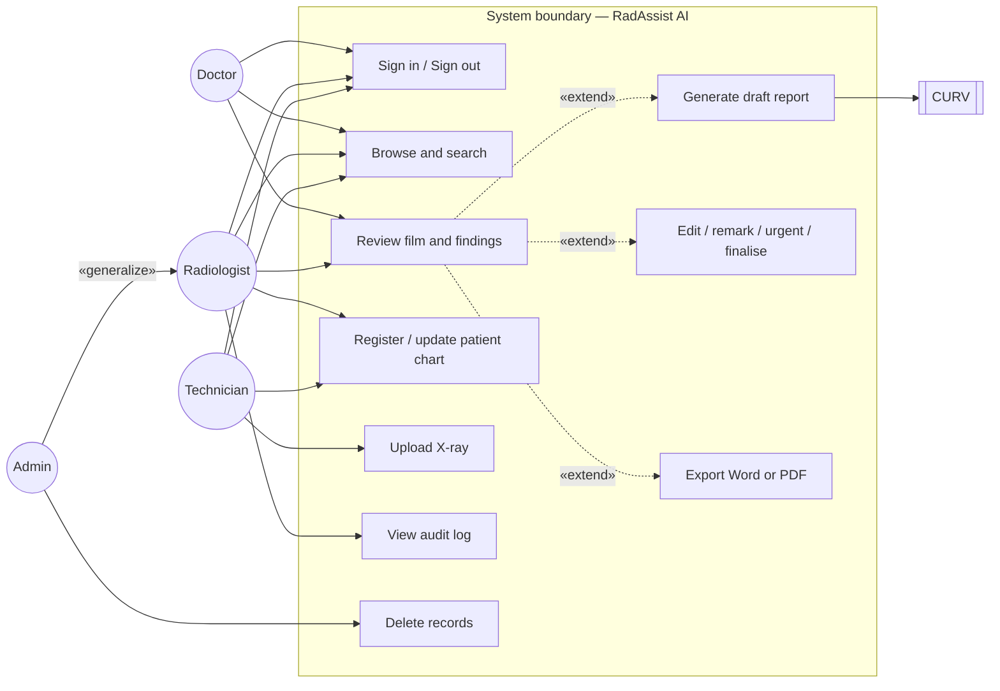
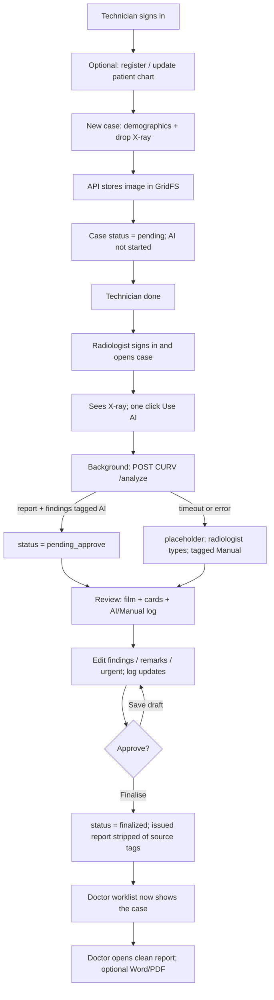
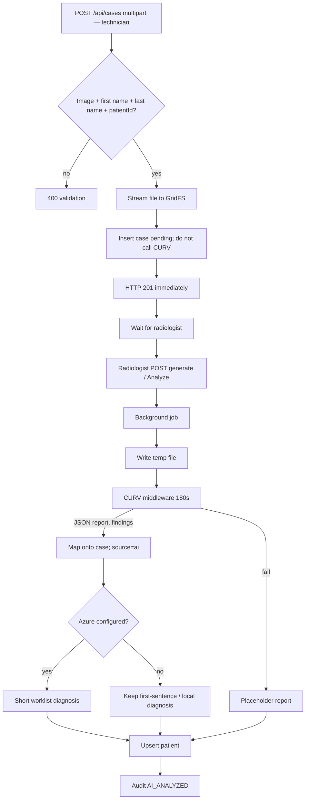
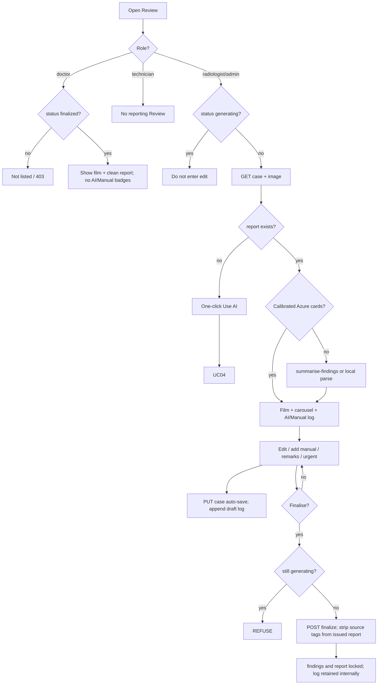
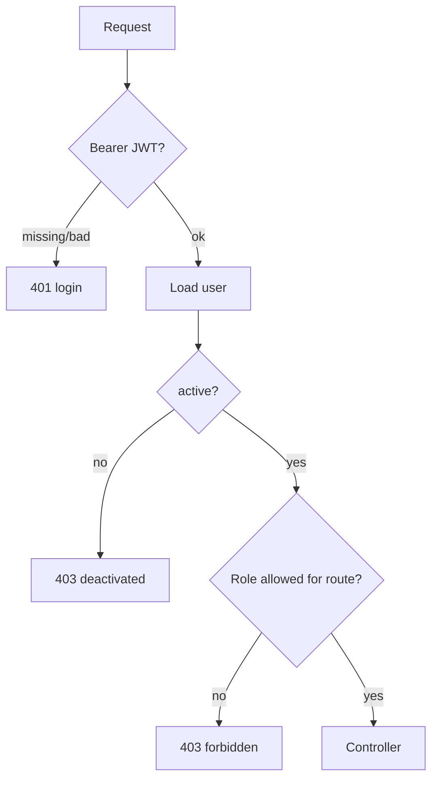
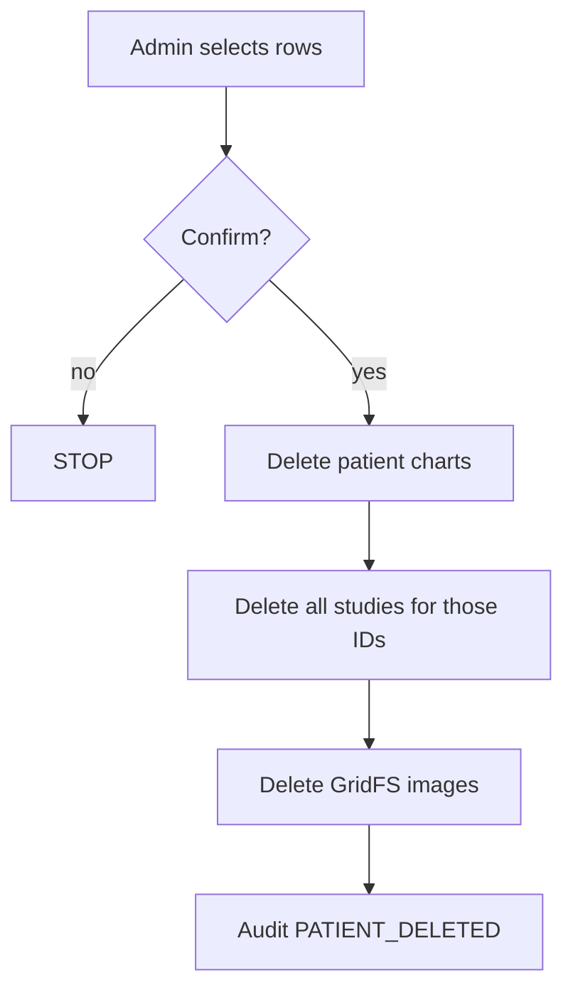
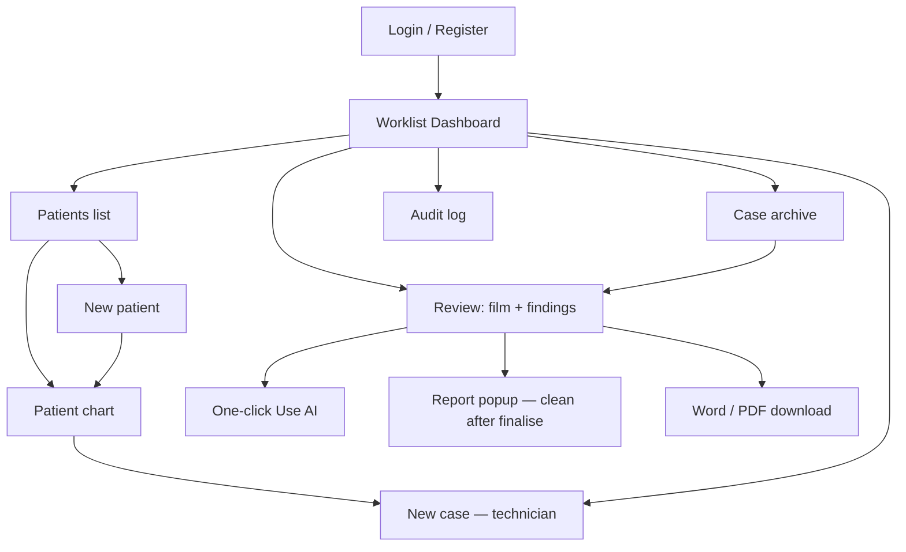

# An AI-assisted Online System for X-Ray Report Generation

**Student:** PANG Ho Yiu (23226609)  
**Working name:** RadAssist AI  
**Document:** Project Plan and Initial System Analysis  
**Source documents:** Project Statement; supervisor briefing slide  
**Type:** Final Year Project (demonstration system, not a clinical product)

> How to use this file: paste into Word, insert the briefing slide as **Figure 1** next to A.1, insert app screenshots in Section B.3, and tick the Department hardware/software list against Section A.2.

---

# a. Project Plan

## A.1 Brief Introduction to the Proposed System

This plan follows the approved **Project Statement** (PANG Ho Yiu, 23226609) and the supervisor briefing: *An AI-assisted Online System for X-Ray Report Generation*. The FYP does **not** retrain CURV or AHIVE. It is the **practicum / deployment** piece: wrap those pretrained engines in a complete web information system that a clinical user can use, edit, and export [3].

### A.1.1 Project background

Medical imaging analysis — especially chest X-ray interpretation — sits in many clinical workflows. The next generation of deep learning and vision-language models, both **generative** (**CURV**: Coherent Uncertainty-Aware Reasoning) and **discriminative** (**AHIVE**: Anatomy-aware Hierarchical Vision Encoding), has pushed the state of the art in writing text-based radiology reports from images [1][2].

Even a well-trained diagnostic model still **languishes in scripts and local research environments**. Radiologists also spend a long time writing the same reports by hand. Outside the lab, a machine-learning model is only as useful as it is **realisable on a fast, safe, accessible platform** that healthcare workers can actually open. Bridging that **deployment gap** into a practicum system is the distinctive part of this FYP [3].

The project therefore builds an **end-to-end web information system**: pretrained AI engines behind a solid web interface, turning raw model output into something a **radiologist** can engage with and **export as a document**, while the **referring doctor** only reads reports that have already been signed off.

The briefing slide shows the intended interaction: film on the left, numbered region boxes, grounded findings on the right. This prototype’s review screen is that layout in a browser.

### A.1.2 Problem / improvement areas

The Project Statement names three operational bottlenecks [3]. The briefing slide states the same core problem: preparing an X-ray report is **professional and yet time-consuming**.

| # | Bottleneck (statement) | What “better” looks like |
| --- | --- | --- |
| 1 | **Time-consuming report workflow.** Diagnostic imaging reports are professional work product and occupy valuable hours. | Technician uploads the film; the radiologist opens the case, **one click** starts AI, then reviews and finalises instead of typing from a blank page. |
| 2 | **Accessibility of AI utilities.** Research models usually have no standard web UI; they stay with the “digital magician,” out of reach of the practitioner. | Browser login and worklist — no Python notebook, no command line. AI is **not** tied to the upload step; only the radiologist triggers it. |
| 3 | **Batch / static I/O.** Image-in, text-out systems are not interactive. Radiologists need to **see the region the model used** and **edit the text**, with a clear record of what was AI vs what they typed. | Side-by-side film + overlays + editable finding cards; an **AI / manual attribution log while drafting**; the **signed report is clean** (no source tags). Word/PDF export of that final text. |

This FYP is an **information-systems** project (workflow, UI, API, documents), not a new accuracy benchmark for CURV.

### A.1.3 Objectives

1. Develop an **online prototype** that uses a pretrained AI model (**CURV**) to **assist** radiologists by generating X-ray reports (briefing + statement).
2. Provide an **interactive, user-friendly interface** that speeds up report preparation: technician upload, radiologist one-click AI, grounded boxes, editable findings, finalise, export (briefing).
3. Wrap the model in a **complete web information system** (sessions, async inference, persistence, document generation) so it is usable outside a research script [3].
4. Keep the **radiologist in the loop**: AI output is a draft until a radiologist (or admin acting as radiologist) finalises it. Referring **doctors** may **read only finalized reports**. Technicians **upload films only**.
5. Run **locally in Semester 1** (supervisor). Optional 24/7 server in **Semester 2**.

### A.1.4 Proposed system

Working name: **RadAssist AI**. Role-separated, clinician-in-the-loop web application:

1. Authorised staff sign in as **technician**, **radiologist**, **doctor**, or **system administrator**.
2. Patient chart (name, age, sex, history, **prior medicines**, **heart rate**, **lab test results**) before or at imaging.
3. **Technician** uploads the chest X-ray to the system (the **only** technician function). Sem 1 formats: **PNG / JPG / JPEG / WebP**. The statement lists DICOM as an example; a DICOM store/viewer is a **Semester 2 stretch**, not required for the first prototype. Upload stores the film; it does **not** start AI.
4. **Radiologist** opens the worklist, sees the uploaded film, and **one click** starts AI. **Asynchronous** backend job calls **local CURV** (`mlx_vlm`); response is report text plus bounding boxes where a finding can be localised [3].
5. Frontend renders the film with **interactive overlays** and **editable finding cards**. While the radiologist edits, the review screen shows an **attribution log** (which sentences/findings are **AI** vs **manual**). Remarks, urgency, explicit **finalisation**.
6. On finalise, the **issued report is the clean clinical text** — AI/manual markers stay in the system audit / draft log and are **not** printed in the report the doctor sees or exports.
7. **Doctor** sees **only finalized** reports (read-only). They do not upload films, run AI, or edit findings.
8. **System administrator** keeps the usual platform functions (all radiologist capabilities plus bulk delete, user/audit administration).
9. Audit log; **PDF / DOCX** export of the **verified, unmarked** report [3].

Decision-support prototype only — not a PACS, not a medical device, not a substitute for a radiologist. If CURV is down, the case is still stored so the radiologist can write the report by hand.

**Out of scope unless Sem 2 time allows:** retraining CURV/AHIVE; full DICOM/PACS; hospital SSO; extra identifiers (e.g. HKID); CE/FDA claims; unattended auto-sign-off.

### A.1.5 Development methodology (from the Project Statement)

Four phases [3]. Success is measured as an **information system** (API behaviour, pipeline latency, browser UI), not only model accuracy.

| Phase | Statement plan | How this prototype implements it |
| --- | --- | --- |
| **1. Requirements & workflow** | Upload → async process → report + bboxes → render with overlays. | **Technician** new-case upload (no AI). Radiologist **one-click generate**; Express returns immediately while CURV runs; worklist “Generating” overlay; Review shows film + boxes. |
| **2. Frontend & interaction** | SPA; **bilateral binding** (text ↔ region); **confidence threshold** slider; **interactive sentence / chip** editing. | Vanilla JS SPA (Vite + Tailwind). Statement mentioned React/Vue as examples; a lightweight SPA meets the same interaction goals. **Now:** finding cards (chips) with inline edit; active card’s bbox on the film; **AI vs manual log on Review while drafting**. **Later (Sem 2 polish):** hover binding both ways; a global confidence slider to show/hide boxes without reload. |
| **3. Backend API gateway** | Node.js routes, sessions, queue; **document engine** (PDF/DOCX) after the user verifies edits. | Express + JWT; background AI job started by radiologist; `docx` / PDF download after save — **export is the clean report**, not the draft attribution log. Cosmos DB + GridFS persist patients, cases, images. |
| **4. Verification & (later) deploy** | Black-box API tests; upload-to-UI latency; browser compatibility. | Frontend unit tests + case e2e script. Sem 1: local demo. Sem 2: optional 24/7 host, more API tests, multi-browser check. |

---

## A.2 Resource Implications

*[Please replace the “Dept list” column after you open the Department’s official hardware and software list. Items not on that list may be unavailable and must be provided by the student or by a free/student cloud tier.]*

### A.2.1 Hardware

| Item | Purpose | Likely on Dept list? | Plan if unavailable |
| --- | --- | --- | --- |
| Student Apple Silicon Mac (already owned) | Run CURV / `mlx_vlm` locally; host the demo | Unlikely (Dept labs are usually Windows PCs) | Use personal Mac for AI inference. This is the critical resource. |
| Dept Windows PC / laptop | Coding, Word, browser testing | Usually yes | Use for documentation and secondary UI testing. Do **not** rely on it for CURV. |
| 16 GB+ RAM, SSD | Model weights + Node + browser | Check list | Personal Mac already meets this. |
| GPU / CUDA workstation | Alternative inference host | Sometimes a shared lab GPU | Not required while `mlx_vlm` runs on Apple Silicon. Sem 2 deploy would need a dedicated box. |
| Display ≥ 1920×1080 | Review screen (film + finding cards) | Yes | Any lab monitor is enough for the viva. |
| Network (campus Wi-Fi / Ethernet) | Cosmos DB and optional Azure OpenAI | Yes | Local CURV still works if cloud is down; cases save with a placeholder report. |

**Implication:** the vision model is tied to the student’s Mac. A Department PC alone cannot currently replace it. That matches the supervisor’s “run on your local machine first” instruction.

### A.2.2 Software

| Item | Role | Licence | Likely on Dept list? |
| --- | --- | --- | --- |
| Node.js 20+, npm | Backend (Express) and frontend (Vite) | Open source | Often yes, or installable by student |
| Python 3.12, `mlx_vlm` | Local CURV server | Open source | **Unlikely** — student-installed on Mac |
| CURV model weights (`~/CURV-mlx`) | Chest X-ray report generation | Research weights already downloaded | Not a Dept item |
| Visual Studio Code / Cursor | Development | Free | Usually yes |
| Git | Version control | Open source | Yes |
| Chrome / Edge / Safari | Client | Free | Yes |
| Microsoft Word / PowerPoint | Report and viva | Campus licence | Yes |
| Express 4, Mongoose 8, JWT, Helmet | REST API, auth, security headers | Open source (npm) | N/A (student stack) |
| Vite 8, Tailwind CSS 3 | UI | Open source | N/A |
| FastAPI / Uvicorn | Thin middleware in front of `mlx_vlm` | Open source | N/A |
| Azure Cosmos DB (Mongo API) | Patients, cases, users, audit, GridFS images | Azure student / pay-as-you-go | Check whether Dept offers Azure credits |
| Azure OpenAI (optional) | Short worklist diagnosis + finding cards | Azure | Optional; system runs without it |
| PlantUML / draw.io / Mermaid | UML for this document | Free | Yes |

**Implication:** all application code is free/open source. The only paid or quota-limited services are Azure Cosmos DB and, if enabled, Azure OpenAI. Neither is required on the Department software CD/image; they are cloud services.

### A.2.3 Data and ethics (resource, not hardware)

Demo patients and films only. No real hospital export. No HKID, address, or other extra identifiers. Seed accounts (`admin123`, etc.) are for local demo only. Chart fields such as prior medicines, heart rate, and lab results are **synthetic demo data**, not real clinical records.

---

## A.3 Development and Operating Costs

Figures are **order-of-magnitude estimates in HKD** for a student demonstration, not a hospital procurement. Labour is the student’s own FYP time and is shown only to make the cost–benefit discussion honest.

### A.3.1 Development costs (one-off, Sem 1–2)

| Cost item | Estimate | Notes |
| --- | --- | --- |
| Student development time (~400–500 hours FYP) | HKD 0 cash (opportunity cost only) | Design, code, test, report, viva |
| Personal Mac already owned | HKD 0 incremental | Would be ~HKD 8,000–15,000 if purchased only for this project |
| CURV weights + `mlx_vlm` | HKD 0 | Already downloaded; research use |
| Open-source stack | HKD 0 | Node, Python, Vite, Express |
| Azure Cosmos DB during development | ~HKD 0–150 / semester | Serverless / student subscription; low document volume |
| Azure OpenAI during development (optional) | ~HKD 0–200 / semester | Only if finding-card vision is turned on |
| Domain / 24/7 VM (Sem 2, optional) | HKD 0 in Sem 1; ~HKD 200–600 / semester later | Supervisor: deploy in Sem 2 |
| **Cash outlay Sem 1** | **≈ HKD 0–350** | Dominated by Azure if used |

### A.3.2 Operating costs (if the demo is kept running)

| Cost item | Local laptop demo | Sem 2 24/7 server (optional) |
| --- | --- | --- |
| Electricity (Mac + screen) | Negligible / personal | VM billed by cloud |
| Database | Cosmos: a few dollars/month at demo scale | Same |
| AI inference | Local Mac: HKD 0 API fees | GPU/Apple box must stay on; electricity + maybe cloud GPU |
| Azure OpenAI | Off = HKD 0; On = usage-based | Same |
| Maintenance | Student restarts three processes | Process manager + backups |
| **Recommended operating mode for FYP** | **Laptop demo for viva** | Only if supervisor requests a public URL |

There is **no licence fee** for the application itself. The expensive part of a real hospital system (PACS, HL7, 24/7 SLA, clinical validation) is deliberately out of scope, so operating cost stays in the student-cloud range.

---

## A.4 Tangible and Intangible Benefits

### A.4.1 Tangible (observable, even in a demo)

| Benefit | Who | How the prototype shows it |
| --- | --- | --- |
| Capture without reporting | Technician | Upload X-ray only; no AI, no edit, no finalise |
| Faster first draft | Radiologist | Open uploaded film → **one click AI** → worklist row moves from *Generating* to *Pending approve* |
| Structured findings, not only a wall of text | Radiologist | Finding carousel: label, location, size, pattern, confidence, bbox on the film |
| Draft provenance | Radiologist | Review log marks each finding/sentence **AI** or **Manual** while editing |
| Clean signed report | Doctor / export | After finalise, the report the doctor sees (and Word/PDF) has **no** AI/manual tags |
| Human sign-off is mandatory | Patient safety (demo) | Status cannot skip to *Finalized* while the draft is still generating; technician and doctor cannot finalise |
| Role separation | Clinic | Technician: upload only. Radiologist: AI + edit + finalise. Doctor: finalized reports only. Admin: platform + delete |
| Searchable worklist | Per role | Filter by status / urgent; live search; urgent rows sort first. Doctor worklist = finalized only |
| Export | Radiologist (and doctor of a finalized case) | Word and PDF of the stored **clean** report (plus the uploaded film) |
| Traceability | Admin / supervisor | Audit log of login, upload, AI analyse, update, finalise, delete; draft AI/manual log retained in the case history even after the issued report is clean |
| Patient chart independent of a film | Technician / radiologist | Patient can exist with zero studies; chart shows **medicines**, **heart rate**, **lab tests**; New Case can look up an existing ID |
| Degraded operation | Ops | If CURV is down, the film is still saved; radiologist can type the report |

### A.4.2 Intangible

- Reinforces **radiologist-in-the-loop** as a design principle (technician captures; AI drafts; radiologist decides; doctor consumes the signed report).
- Gives referring doctors a way to **see** signed reports and patient context without being able to alter imaging interpretation.
- Student learning: full-stack web system, JWT roles, GridFS, local VLM, optional cloud NLP.
- Reusable demo for the viva: one laptop, three processes, seeded users (technician / radiologist / doctor / admin).
- Clear story for Semester 2 (hardening, CORS, cookies, possible deploy) without blocking Semester 1.

---

## A.5 Cost–Benefits Analysis

This is not a commercial product, so a classic NPV is not meaningful. The comparison is **student cash + time versus FYP learning outcomes and demo quality**.

| Option | Cash (Sem 1) | Time | Benefit | Risk |
| --- | --- | --- | --- | --- |
| **A. Do nothing / report-only FYP** | HKD 0 | Low | Weak viva | Fails “working system” expectation |
| **B. Script: image in, text out (old demo)** | HKD 0 | Low–medium | Proves CURV works | No workflow, no roles, no persistence |
| **C. Proposed local web system (recommended)** | HKD 0–350 | High | Full use-case demo, audit, HITL, role split | Tied to student’s Mac for AI |
| **D. Full 24/7 hospital-like deploy now** | Higher VM/GPU | High + ops | Public URL | Supervisor deferred this to Sem 2; over-scope |

**Conclusion:** Option C dominates. Incremental cloud cost is small compared with the jump from a one-page CURV tester to a role-based reporting workflow. Option D’s extra cost does not buy extra FYP marks in Semester 1 and conflicts with supervisor guidance. Intangible benefit of C (safety workflow, audit, technician / radiologist / doctor split) is exactly what a project titled *“AI-assisted Online System”* should show: **assisted**, not autonomous; **online** (browser + API), not a notebook.

Break-even in money terms is immediate: almost all spend is already-owned hardware and free software. The scarce resource is student hours, which are required by the FYP anyway.

---

## A.6 Development Schedule

Supervisor constraint: **local machine in Semester 1; server deployment may wait until Semester 2.**  
Academic year assumed: 2026/27. Adjust week numbers to the Department calendar.

The Gantt implements the four statement phases: WP1 = Phase 1 (requirements); WP2–4 = Phase 3 (gateway + async AI); WP5–6 = Phase 2 (interactive UI + export); WP8 + WP11 = Phase 4 (verification); WP10 = Phase 4 deploy.

### A.6.1 Gantt-style plan

| ID | Work package | Sem 1 Wks 1–4 (Sep) | Wks 5–8 (Oct) | Wks 9–12 (Nov) | Wks 13–14 (Dec) | Sem 2 Jan–Feb | Mar–Apr | May |
| --- | --- | --- | --- | --- | --- | --- | --- | --- |
| WP1 | Requirements, this plan, use cases, UI storyboards | **██** | ░ | | | review | | |
| WP2 | Local CURV + FastAPI middleware | **██** | █ | | | | | |
| WP3 | Express API, Cosmos, JWT roles, GridFS | █ | **███** | █ | | | | |
| WP4 | Patients, technician upload, radiologist one-click generate | | **██** | █ | | | | |
| WP5 | Review UI: film, boxes, carousel, AI/manual log, remarks, urgent, finalise | | █ | **███** | █ | polish | | |
| WP6 | Worklist (role-filtered), archive, audit, Word/PDF, doctor read-only finalized | | | **██** | █ | | | |
| WP7 | Optional Azure diagnosis / finding cards | | | █ | █ | eval | | |
| WP8 | Tests, seed data, bug-fix, viva script | | | █ | **██** | █ | | |
| WP9 | FYP report chapters (analysis, design, implementation) | █ | █ | █ | **██** | **██** | **██** | |
| WP10 | Sem 2: hardening + optional 24/7 deploy | | | | | █ | **██** | |
| WP11 | Evaluation, limitations, viva | | | | demo | | █ | **██** |

█ = planned intensive work. The implementation WPs 2–6 are **already substantially built** in the current prototype; remaining Sem 1 effort is aligning roles to this plan (technician / radiologist / doctor / admin), the Review attribution log, richer patient chart vitals/labs/meds, documentation, evaluation, and polish.

### A.6.2 Milestones

| Milestone | Target | Exit criteria |
| --- | --- | --- |
| M1 Local CURV path | Early Sem 1 | Radiologist one-click on an uploaded film → markdown report returned |
| M2 HITL web workflow | Mid Sem 1 | Technician uploads; radiologist AI → review → finalise; doctor sees only finalized; technician cannot edit |
| M3 Supervisor checkpoint | When this document is submitted | Confirm scope: local demo OK; deploy Sem 2 |
| M4 Sem 1 demo freeze | End of Sem 1 | Seeded users (four roles), three processes start script, no blocker bugs |
| M5 Optional deploy | Sem 2 | Reverse proxy + secrets; CURV still on a dedicated host |
| M6 Viva | Sem 2 | 10-minute live walkthrough (see README demo script) |

### A.6.3 Dependencies and slack

- WP5 depends on WP3–4 (case must exist with `imageId`; AI may still be unrun).
- WP7 is optional; WP5 has a local markdown parser if Azure is off.
- WP10 must not start until M3 (supervisor) agrees.
- Critical path is **Mac + CURV remaining available** for any live demo.

---

## A.7 System Recommendation

**Recommend proceeding with the proposed system (Option C)** as the FYP implementation vehicle.

### A.7.1 Recommended architecture (summary)

```
Browser (Vite, localhost:5173)
        → Express API (localhost:5002, JWT + roles)
              → Azure Cosmos DB (Mongo API) + GridFS
              → FastAPI middleware (localhost:8001)
                    → mlx_vlm CURV (localhost:8080)
              → Azure OpenAI (optional)
```

- **Presentation:** vanilla JS SPA + Tailwind (Vite). The Project Statement named React/Vue as example frameworks; the SPA behaviour (upload, overlays, chips, export) is what matters.
- **Application:** REST, role middleware, audit writer.
- **Data:** Patient (incl. medicines, heart rate, lab results), Case (findings, report, status, urgent, **draft attribution log**), User, AuditLog, images in GridFS.
- **AI:** local CURV for the report; optional Azure for short diagnosis labels and finding cards. Started **only** by radiologist (or admin) click, not by technician upload.
- **Control principle:** AI never finalises. Status is `pending` (film stored, AI not run or still generating) → `pending_approve` → `finalized`. Issued report text is unmarked.

### A.7.2 Why this, not the alternatives

| Alternative | Why not (for this FYP) |
| --- | --- |
| Standalone CURV webpage only | No patients, roles, audit, or sign-off — does not match “online system” |
| Fully automatic reports | Clinically unacceptable; contradicts HITL |
| AI on upload (no radiologist click) | Mixes capture with interpretation; technician would trigger clinical AI |
| Cloud-only vision API, no local CURV | Loses the model already running on the Mac; ongoing token cost; weaker “we run the model” story |
| Native desktop app | Harder to show “online”; worse for Sem 2 deploy |
| Full PACS / DICOM in Sem 1 | Statement allows DICOM as an example format; raster upload is enough to prove the workflow. DICOM is a Sem 2 stretch. |

### A.7.3 Conditions of recommendation

1. Keep the **human-in-the-loop** rule in every demo and in the report: radiologist signs; doctor reads finalized only.
2. Stay on **localhost for Sem 1**, as advised.
3. Treat Azure OpenAI as **optional enhancement**, not a single point of failure.
4. Do not collect extra personal identifiers.
5. Label every AI output as draft / decision support **on the Review screen**; the **finalized report** presented to the doctor is unmarked clinical text.
6. Sem 2 deploy only after CORS, registration lock-down, and secret handling are tightened.

**Recommendation statement:** *The Department is requested to approve this project plan and the initial analysis below. The student will continue development on a local machine and will not require non-list hardware from the Department beyond standard lab PCs for documentation. The Apple Silicon Mac and CURV weights are student-provided.*

---

# b. Initial System Analysis

## B.1 Initial Use Case Model

### B.1.1 Actors

| Actor | Type | Description |
| --- | --- | --- |
| Technician | Primary | Signs in, optionally looks up / registers a patient for imaging, **uploads the X-ray**. No AI, no report edit, no finalise, no export of drafts |
| Radiologist | Primary | Opens uploaded films, **one-click AI**, edits findings/report, marks urgent, finalises, exports. **Replaces the former “doctor” reporting function** |
| Doctor | Primary | Referring clinician: browses **finalized reports only**; read-only film + clean report + patient chart (meds, heart rate, labs). Cannot upload, run AI, or edit |
| System administrator | Primary | All radiologist functions plus bulk delete of cases, patients, and audit rows; user administration |
| CURV (local VLM) | Supporting | Returns `{ report, findings }` when the radiologist requests analysis |
| Azure OpenAI | Supporting (optional) | Short diagnosis label; finding cards with boxes |
| Cosmos DB | Supporting | Persists users, patients, cases, audit, images |

Guest / anonymous users have only Login and (demo) Register. Public register is **demo-only** and should be disabled in any later deploy.

The previous nurse / “doctor does everything” split is **superseded**. Capture (technician), interpretation (radiologist), and consumption of signed reports (doctor) are three different jobs.

### B.1.2 Use case diagram

Actors are specialised by **job**, not by a linear generalisation of “nurse ⊂ doctor ⊂ admin”. Technician, radiologist, and doctor share sign-in and (role-filtered) browse. Supporting system **CURV** is on the right. Details of UC06–UC08 stay in the descriptions; on the diagram they sit under «extend» from Review.



Same diagram as a Word-friendly sketch (paste into draw.io or redraw in PowerPoint):

```
 Admin ──«generalize»──► Radiologist
    │                         ├── Sign in / Sign out
    │                         ├── Browse and search
    │                         ├── Review film ──«extend»──► One-click Generate draft ──► CURV
    │                         │               └──«extend»──► Edit / remark / urgent / finalise
    │                         │               └──«extend»──► Export Word / PDF
    │                         ├── Register / update patient chart
    │                         └── View audit log
    └── Delete records

 Technician ── Sign in / Browse / Patient chart (create for imaging) / Upload X-ray
 Doctor     ── Sign in / Browse finalized only / Review read-only (clean report)
```

**Include / extend:** Upload does **not** include Generate draft. Generate is an **extend** of Review (radiologist click). Edit, remarks, urgent, finalise, and export also extend Review. Optional Azure finding-cards extend Review when configured (not shown, to keep the figure small).  
**Who can do what:** see the role matrix in B.1.4.

### B.1.3 Use case descriptions

#### UC01 Sign in

| Field | Content |
| --- | --- |
| ID | UC01 |
| Actors | Technician, Radiologist, Doctor, Admin |
| Goal | Obtain a session so role-based screens are shown |
| Precondition | Account exists and is active |
| Main success | 1. User opens the app. 2. Enters username/email and password. 3. System verifies password, issues JWT, writes LOGIN audit. 4. User lands on the worklist appropriate to their role. |
| Alternatives | Invalid credentials → error, stay on login. Deactivated account → forbidden. |
| Postcondition | `user` + token in session; sidebar matches role (technician: upload only; doctor: no New case / no draft review; radiologist: Review + AI; admin: full). |

#### UC02 Register / update patient chart

| Field | Content |
| --- | --- |
| ID | UC02 |
| Actors | Technician, Radiologist, Admin |
| Goal | Create or update a chart before / around imaging |
| Precondition | Signed in as technician, radiologist, or admin |
| Main success | 1. Open New patient or existing chart. 2. Enter first name, last name, age, sex (middle name and ID optional). 3. Record **prior medicines**, **heart rate**, and **lab test results** (demo fields). 4. Empty ID → system assigns `PT-{year}-{nnnn}`. 5. Patient stored; studies optional. 6. Chart opens. |
| Alternatives | Duplicate / already found in type-ahead → open existing chart. Doctor → chart **read-only** (may see meds / HR / labs with finalized studies). |
| Postcondition | Patient document exists; PATIENT_CREATED / PATIENT_UPDATED audit. |

#### UC03 Create case and upload X-ray

| Field | Content |
| --- | --- |
| ID | UC03 |
| Actors | Technician (primary); Admin (may also upload) |
| Goal | Attach a film to a patient so a radiologist can report. **This is the technician’s only clinical function.** |
| Precondition | Signed in as technician or admin; file is PNG/JPG/JPEG/WebP |
| Main success | 1. Open New case (optionally from a chart). 2. Lookup patient ID or enter demographics. 3. Drop/select image. 4. Submit. 5. Image stored in GridFS; case saved as `pending` (**AI not started**). 6. User returns to worklist. |
| Alternatives | Missing name/ID/file → validation toast. Radiologist / doctor → upload hidden or forbidden (radiologist works from films already in the queue). |
| Postcondition | Case exists with `imageId`; CASE_CREATED audit. UC04 is **not** running until the radiologist clicks. |

#### UC04 Generate draft report (one-click AI)

| Field | Content |
| --- | --- |
| ID | UC04 |
| Actors | CURV (supporting); Radiologist / Admin (initiator from Review or worklist **Analyse** control) |
| Goal | Produce draft `reportText` and findings without blocking the UI; radiologist stays in control of **when** AI runs |
| Precondition | Case stored with an image; user is radiologist/admin; AI middleware reachable *or* failure handled |
| Main success | 1. Radiologist opens the case and **clicks once** to use AI. 2. Backend writes a temp file. 3. POST to `/analyze` (timeout ~180s) with age/sex/history (and chart context if available). 4. Map `{ report, findings }` onto the case; each generated finding/sentence tagged `source: ai` in the **draft log**. 5. Optional Azure short diagnosis. 6. Status → `pending_approve`. 7. Upsert patient from case. 8. AI_ANALYZED audit. |
| Alternatives | CURV down/timeout → placeholder report, still `pending_approve`, radiologist completes by hand (`source: manual`). Technician / doctor → cannot start AI. |
| Postcondition | Radiologist can continue Review. Worklist overlay clears when status is no longer generating. |

#### UC05 Review film and findings

| Field | Content |
| --- | --- |
| ID | UC05 |
| Actors | Radiologist, Admin (edit); Doctor (read-only, **finalized cases only**); Technician (may see that the film was uploaded, not the reporting workspace) |
| Goal | See film, boxes, and finding cards together; for radiologist, also see **AI vs manual** attribution while drafting |
| Precondition | User authenticated. Doctor: case must be `finalized`. Radiologist: case not still generating (or generating overlay). |
| Main success | 1. Open Review from worklist. 2. Load case and image. 3. If needed, Azure summarise-findings or local parse into up to six cards. 4. Show carousel + overlays. 5. **Draft state:** each card/sentence shows **AI** or **Manual**; a compact log lists edits. 6. **Finalized state (doctor and export):** report body is **clean** — no source tags in the text. |
| Alternatives | Still generating → Review blocked for editing. Doctor on non-finalized case → hidden / forbidden. Technician → no Review edit UI. |
| Postcondition | Radiologist understands the draft and may continue to UC06–UC10. Doctor understands the signed report. |

#### UC06 Edit findings or add manual finding

| Field | Content |
| --- | --- |
| ID | UC06 |
| Actors | Radiologist, Admin |
| Goal | Correct AI output or add a finding the model missed, with a visible draft log |
| Precondition | UC05; case not finalised |
| Main success | Edit label/location/size/pattern or rewrite report sentences; or **+ Add manually** (`source: manual`). Auto-save / Save draft to MongoDB. The Review **attribution log** records: original AI fragment, replacement text, actor, time. |
| Alternatives | Finalised → fields locked; log no longer shown on the issued report (retained in audit / case history for viva). Doctor / technician → no. |
| Postcondition | `findings[]` and draft log updated; CASE_UPDATED audit. Issued report text, if later finalised, does **not** contain the log. |

#### UC07 Save remarks

| Field | Content |
| --- | --- |
| ID | UC07 |
| Actors | Radiologist, Admin |
| Goal | Add follow-up notes that do not rewrite a locked report body after sign-off |
| Precondition | Case exists |
| Main success | Type remarks; save (allowed **after** finalise). Chart remarks on the patient are separate and are **not** copied into the case report. |
| Postcondition | `remarks` stored. |

#### UC08 Mark or clear urgent

| Field | Content |
| --- | --- |
| ID | UC08 |
| Actors | Radiologist, Admin (doctor can **see** the tag on a finalized case only) |
| Goal | Triage flag (not a legal priority) |
| Precondition | Case exists |
| Main success | Toggle urgent; worklist and patient list show the chip; urgent rows sort first. Allowed after finalise. |
| Postcondition | `urgent` boolean updated. |

#### UC09 Finalise report

| Field | Content |
| --- | --- |
| ID | UC09 |
| Actors | Radiologist, Admin |
| Goal | Sign off: diagnosis, report text, and findings become immutable **clinical text without AI/manual labels** |
| Precondition | Status is `pending_approve` (not still generating) |
| Main success | Confirm Finalise & approve; system **strips source tags from the issued `reportText`**; `finalizedBy` recorded; CASE_FINALIZED audit. Draft attribution remains in an internal log / audit, not in the doctor-facing report. |
| Alternatives | Still generating → refused. Technician / doctor → forbidden. |
| Postcondition | Status `finalized`; remarks and urgent still editable by radiologist/admin; doctor can now see the case. |

#### UC10 Export Word or PDF

| Field | Content |
| --- | --- |
| ID | UC10 |
| Actors | Radiologist, Admin; Doctor (finalized case only) |
| Goal | Take a copy of the stored **clean** report plus the film |
| Precondition | Case loaded; unsaved edits flushed first; doctor only if finalized |
| Main success | Download `.docx` or PDF. Finding cards stay on screen and are **not** merged into the file. File contains **no** AI/Manual watermarks. |
| Postcondition | File on disk; database unchanged except last flush. |

#### UC11 Browse worklist

Dashboard: counts (total, urgent, finalized, pending approve), chips, search (`/` focuses), View vs Review, admin checkboxes.

- **Technician:** sees uploads they sent (and generating/pending rows as “with radiologist”), no Analyse/Finalise.
- **Radiologist / Admin:** full worklist including drafts.
- **Doctor:** **finalized rows only**.

#### UC12 View patient chart

Identity, history, **prior medicines**, **heart rate**, **lab test results**, latest **finalized** diagnosis where applicable, findings from studies the role may see, chart remarks. Technician / radiologist: New case from chart fills demographics. Doctor: read-only; studies list restricted to finalized.

#### UC13 View case archive

Same search/pagination pattern as the worklist; study-centric rather than triage-centric; doctor still finalized-only.

#### UC14 View audit log

Radiologist and admin may read; filter by text/action. Technician and doctor: not in nav.

#### UC15 Delete records

Admin only: single or bulk delete of cases (and GridFS image), patients (chart + all studies + images), or audit rows. Confirmation required.

#### UC16 Search and filter

Debounced search across IDs, names, diagnosis, report, history; status chips; urgent-only. Doctor search does not surface non-finalized cases.

#### UC17 Sign out

Clear session; LOGOUT audit.

### B.1.4 Brief use-case–role matrix

| Use case | Technician | Radiologist | Doctor | Admin |
| --- | --- | --- | --- | --- |
| UC01 Sign in / UC17 Sign out | Y | Y | Y | Y |
| UC11–13 Browse | Y (own uploads) | Y (all) | Y (**finalized only**) | Y |
| UC05 Review (read) | N (upload confirmation only) | Y (draft + final) | Y (finalized, **clean** report) | Y |
| UC02 Patient chart write | Y | Y | N (read) | Y |
| UC03 Upload X-ray | **Y (only function)** | N | N | Y |
| UC04 One-click AI | N | Y | N | Y |
| UC06 Edit / UC09 Finalise | N | Y | N | Y |
| UC07 Remarks / UC08 Urgent | N | Y | N (see tag if finalized) | Y |
| UC10 Export | N | Y | Y (finalized) | Y |
| UC14 Audit read | N | Y | N | Y |
| UC15 Delete | N | N | N | Y |

---

## B.2 Initial Activity Diagrams

### B.2.1 End-to-end reporting (happy path)



### B.2.2 Upload and AI generation (detail)



### B.2.3 Review, save, finalise



### B.2.4 Authentication and authorisation



### B.2.5 Admin delete (patients)



---

## B.3 Initial User Interface Prototype

Screens below match the **intended prototype** after this role redesign (dark sidebar, cyan accents, worklist-first). For the printed report, replace the wireframes with **screenshots** of the running app (`http://localhost:5173`) using the seeded users.

### B.3.1 Site map / screen flow



- **Technician:** New case / New patient; no Audit; no Review edit; no Use AI.
- **Radiologist:** Review, Use AI, edit, finalise, Audit; typically no New case (films arrive from technician).
- **Doctor:** Worklist and Review **finalized only**; patient chart read-only; no New case / New patient / Audit.
- **Admin:** full shell, including delete.

### B.3.2 Wireframe 1 — Login

```
┌─────────────────────────────┬──────────────────────────┐
│  RadAssist AI               │   Sign in                │
│  Faster X-Ray reporting,    │   Username / email       │
│  with the radiologist in    │   Password               │
│  control.                   │   [ Sign in ]            │
│                             │   Demo: Technician /     │
│  FYP demonstration.         │   Radiologist / Doctor / │
│                             │   Admin quick buttons    │
└─────────────────────────────┴──────────────────────────┘
```

Purpose: role is chosen by account, not by a dropdown (prevents “login as radiologist” spoofing on the client).

### B.3.3 Wireframe 2 — Shell + Worklist

```
┌──────┬─────────────────────────────────────────────────┐
│ RA   │  Worklist                    [ / search     ]   │
│------│  ┌────┐ ┌────┐ ┌────┐ ┌────┐                    │
│Work- │  │Tot │ │Urg │ │Fin │ │Pend│                    │
│list  │  └────┘ └────┘ └────┘ └────┘                    │
│Pat.  │  chips: All | Awaiting AI | Pending | Finalized │
│Cases │  ┌───────────────────────────────────────────┐  │
│Audit │  │ URGENT | PT-… | Name | Dx | Status | Rad  │  │
│------│  │        |      |      |    | Review | View │  │
│+ Case│  └───────────────────────────────────────────┘  │
│+ Pat.│  generating overlay when radiologist started AI │
│------│                                                 │
│User  │  Doctor: Finalized chip locked on; no + Case    │
│Logout│  Technician: + Case only; no Review AI          │
└──────┴─────────────────────────────────────────────────┘
```

### B.3.4 Wireframe 3 — New patient / chart extras

```
┌────────────────────────────────────────────────────────┐
│  New patient                                           │
│  Patient ID (optional)   First   Middle   Last         │
│  Age    Sex: Female | Male | Other                     │
│  Clinical history (chart; not copied into reports)     │
│  Prior medicines  [e.g. metformin, amlodipine]         │
│  Heart rate       [e.g. 78 bpm]                        │
│  Lab test results [e.g. Hb 13.2; WBC 7.1; CRP 4]       │
│                         [ Create patient ]             │
└────────────────────────────────────────────────────────┘
```

On the **patient page**, the same three blocks remain visible after create: medicines taken before, heart rate, lab results, plus the study table.

### B.3.5 Wireframe 4 — New case (upload) — technician

```
┌──────────────────────────────┬─────────────────────────┐
│ Patient ID [Lookup]          │                         │
│ Name / age / sex / history   │     ┌───────────┐       │
│ (locked if chart matched)    │     │  drop     │       │
│                              │     │  X-ray    │       │
│ [ Upload X-Ray ]             │     └───────────┘       │
│ AI is not started here.      │                         │
└──────────────────────────────┴─────────────────────────┘
```

After submit: navigate to worklist; do not sit on a spinner page. Radiologist will see the film waiting.

### B.3.6 Wireframe 5 — Review (main clinical screen) — radiologist

```
┌────────────────────────────────────┬───────────────────┐
│ PT-2026-0018  CHAN Tai Man  URGENT │ Finding 2 of 4    │
│ status: Pending approve            │ Label [        ]  │
│                                    │ Location / size   │
│  ┌──────────────────────────────┐  │ Pattern ▼         │
│  │                              │  │ Confidence  72%   │
│  │     chest X-ray              │  │ Sentence          │
│  │     + bbox overlay           │  │ source: AI | Manual│
│  │                              │  │ ◀ ● ● ○ ▶        │
│  └──────────────────────────────┘  │ [+ Add manually]  │
│                                    │ Remarks           │
│ [ Use AI ]  (one click)            │ [Save draft]      │
│ Report | Word | PDF                │ [Finalise]        │
│                                    │ [Mark urgent]     │
│ Draft log (while editing):         │                   │
│  14:02 AI generated para 1         │                   │
│  14:11 Radiologist replaced s2     │                   │
│  (hidden after Finalise on issued  │                   │
│   report; kept in audit)           │                   │
└────────────────────────────────────┴───────────────────┘
```

**Doctor (finalized):** same film + report layout; **no** Use AI, no source badges, no draft log, no save/finalise. They read the eventual unmarked report.

**Technician:** does not use this screen for reporting.

This layout is the web version of the briefing slide: current image + numbered boxes on the left, grounded finding list (editable cards) on the right. In Word, put the briefing screenshot as Figure 1 and this running-app screenshot as Figure *n*.

### B.3.7 Wireframe 6 — Patient chart and Audit

**Chart:** identity header; **prior medicines**; **heart rate**; **lab test results**; history; remarks (chart-level); table of studies with status/urgent (doctor: finalized only); button New case for technician.  
**Audit:** filter box, action chips, table (time, user, action, target). Admin: bulk delete. Includes AI_ANALYZED and CASE_UPDATED (manual edit) rows.

### B.3.8 Storyboard — “From film to signed report”

| Frame | Actor | Screen | Action | System response |
| --- | --- | --- | --- | --- |
| 1 | Technician | Login | Signs in as technician | JWT; worklist |
| 2 | Technician | New patient / chart | Enters name, meds, HR, labs | Chart with `PT-2026-00xx` |
| 3 | Technician | New case | Looks up ID, drops PNG | 201; row **Awaiting radiologist** (no AI yet) |
| 4 | Radiologist | Login → Worklist | Opens the new film | Sees X-ray immediately |
| 5 | Radiologist | Review | **One click Use AI** | Overlay **Generating**; CURV fills report; cards tagged **AI** |
| 6 | Radiologist | Review | Corrects a label, adds a manual finding | Draft log: AI vs Manual; auto-save |
| 7 | Radiologist | Review | Marks **Urgent**, **Finalise & approve** | Status **Finalized**; issued report **clean** (no source tags) |
| 8 | Doctor | Login → Worklist | Opens same case | Sees film + unmarked report; **cannot** save or run AI |
| 9 | Admin | Audit | Filters CASE_FINALIZED / CASE_UPDATED | Evidence for viva / integrity; draft provenance still in log |

### B.3.9 Storyboard — “AI unavailable”

| Frame | Action | Result |
| --- | --- | --- |
| 1 | Technician uploads while CURV is stopped | Case still created; radiologist still sees the film |
| 2 | Radiologist clicks Use AI | Timeout / placeholder; findings tagged **Manual** as they type |
| 3 | Radiologist types report + manual findings | Same finalise path; issued report still unmarked |
| Message | Prototype stays usable as an **online reporting** tool even when the model is down | |

### B.3.10 UI design notes (initial)

- **Primary colour:** cyan on slate; dark nav so the film uses full width.
- **Density:** hospital worklist, not a marketing landing page.
- **Feedback:** toasts for errors; centred generating overlay after **Use AI**; disabled buttons while `busy`.
- **Safety copy:** login and README state this is an FYP demonstration / draft findings. Draft screens show AI vs Manual; **finalized / exported reports do not**.
- **Keyboard:** `/` focuses search on list pages.
- **Responsive:** sidebar becomes a drawer on small screens (demo is still desktop-first).
- **Statement UI (Phase 2):** finding cards = interactive diagnostic chips. Active card drives the bbox (one direction of bilateral binding). Confidence is shown per card; a **filter slider** and **hover-both-ways** highlighting are Sem 2 polish, not Sem 1 blockers.

### B.3.11 Prototype → implementation map

| Storyboard screen | Module |
| --- | --- |
| Login | `src/components/login.js` |
| Worklist | `dashboard.js` |
| New patient | `newPatient.js` |
| Patients / chart (meds, HR, labs) | `patients.js` |
| New case (technician upload) | `newCase.js` |
| Review (Use AI, AI/manual log, finalise) | `review.js` |
| Report popup (clean issued text) | `reportView.js` |
| Archive | `cases.js` |
| Audit | `audit.js` |
| Shell | `header.js` |

---

## Appendix A — Assumptions and items for the supervisor

1. Department hardware/software list was **not attached** to this draft; Table A.2 should be ticked against the official PDF.
2. “Urgent” means **triage in the demo**, not a defined clinical protocol — confirm wording if needed.
3. Azure OpenAI is optional; the viva can run on CURV + local finding parse only.
4. Public `POST /api/auth/register` is for the demo and should not appear in a Sem 2 public deploy.
5. Evaluation follows the statement (Phase 4): black-box API tests, upload-to-UI latency, browser checks — not a clinical trial of CURV accuracy.
6. React/Vue in the statement are **example** SPA stacks; vanilla JS + Vite is the implemented SPA.
7. DICOM remains a stretch format; Sem 1 demo uses PNG/JPEG/WebP.
8. **Role model (this revision):** Technician = upload only; Radiologist = former doctor reporting function + one-click AI; Doctor = finalized reports only; Admin unchanged. The current codebase may still use `doctor` / `nurse` until implementation catches up — this document is the target design.
9. Patient **medicines**, **heart rate**, and **lab results** are demo chart fields, not a full EMR or HL7 feed.
10. **AI vs Manual** attribution is for the radiologist on Review and for audit. The **eventual signed report** (on-screen for the doctor, Word, PDF) is unmarked.

---

## Appendix B — Glossary

| Term | Meaning in this project |
| --- | --- |
| Case / study | One visit, one film, one report |
| Finding card | Structured row: label, bbox, location, size, pattern, confidence, draft `source` (`ai` \| `manual`) |
| Pending | Film stored; AI not yet run, or CURV still generating |
| Pending approve | Draft ready for the radiologist |
| Finalized | Signed; report and findings locked; **issued text has no AI/manual tags** |
| Draft attribution log | Review-time record of which fragments came from AI vs the radiologist; **not** part of the issued report |
| Technician | Staff who only upload X-rays into the system |
| Radiologist | Staff who open the film, run AI, edit, and finalise (replaces the old “doctor” reporting role) |
| Doctor | Referring clinician who sees **finalized** reports only |
| CURV | Local chest X-ray VLM used in this prototype; from Wang et al., NeurIPS 2025 [1] |
| AHIVE | Anatomy-aware interactive report retrieval (related research, CVPR 2024) [2] |
| Grounded finding | A finding tied to a region (bbox) on the film, as in the briefing UI |
| HITL | Human-in-the-loop: technician captures; AI drafts; radiologist decides; doctor reads the signed report |

---

## Appendix C — References

[1] Ziao Wang, Sixing Yan, Kejing Yin, Xiaofeng Zhang, and William K. Cheung. CURV: Coherent Uncertainty-Aware Reasoning in Vision-Language Models for X-Ray Report Generation. *Advances in Neural Information Processing Systems (NeurIPS)*, 2025.

[2] Sixing Yan, William K. Cheung, Ivor W. Tsang, Keith Chiu, Terence M. Tong, Ka Chun Cheung, and Simon See. AHIVE: Anatomy-aware Hierarchical Vision Encoding for Interactive Radiology Report Retrieval. In *Proceedings of the IEEE/CVF Conference on Computer Vision and Pattern Recognition (CVPR)*, pp. 14324–14333, Seattle, WA, USA, June 2024.

[3] PANG Ho Yiu. *Project Statement: An AI-assisted Online System for X-Ray Report Generation* (Student no. 23226609). Hong Kong Baptist University, Department of Computer Science.
